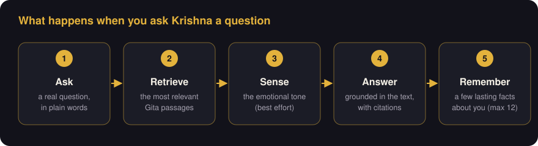
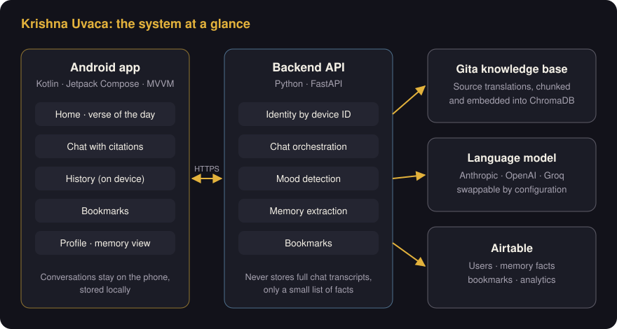

# Krishna Uvaca, Ancient Wisdom for Modern Questions
Tags: Projects, AI, Mobile
Date: 2026-09-23
Summary: A RAG system built on the Bhagavad Gita. Ask life's questions and get answers that cite the verse they come from.

Krishna Uvaca is an Android companion for the Bhagavad Gita. It's a calm, AI-guided space where you can bring a real question and get an answer grounded in the Gita's own text, with the verses cited. This post walks through why we built it, how it works, and the engineering decisions behind it.

## Why this project exists

People turn to the Gita for very practical reasons, like a hard decision at work, a restless night, or a question about purpose. The text itself can feel dense and intimidating. General-purpose chatbots will happily answer spiritual questions, but they don't separate what the scripture says from what the model makes up. For this subject, that difference is the whole point.

So we set one principle before writing any code.

> **The text is the authority. The AI is the guide.**

Every answer should trace back to a verse. The app should feel like a quiet room, not another feed competing for your attention. The name follows from that. *Krishna uvaca* means "Krishna said".

## Who it's for

- People newly curious about the Gita who find the original intimidating
- Daily practitioners who want a companion for reflection
- Students studying the text
- Working professionals looking for grounded perspective under pressure
- Older users who value a slower, respectful, text-first experience

## What it does today

| Capability | What the user experiences |
|---|---|
| **No-friction start** | Type your name once. No account and no password. The device remembers you. |
| **Calm home screen** | A time-of-day greeting and a verse of the day, with one clear way into the conversation. |
| **Grounded chat** | Answers come back in short, titled sections, with the source verses listed underneath. |
| **Mood awareness** | Each message gets a light read of its emotional tone, so replies feel attuned. If that check fails, the chat carries on without it. |
| **Krishna Memory** | Krishna quietly learns a few lasting facts about you, such as an ongoing goal or a recurring theme, capped at 12. You can see the full list on your profile. |
| **History** | Every past conversation is kept on the phone, and you can reopen any of them. |
| **Bookmarks** | Save a cited verse straight from the chat, with your own note, and come back to it later. |

## How it works

When someone asks a question, five things happen in about the time it takes to read this sentence.

1. **Ask.** The user types a question in plain language.
2. **Retrieve.** The backend searches the Gita source texts for the passages closest in *meaning* to the question, not just the ones that share keywords. This technique is called **Retrieval-Augmented Generation (RAG)**.
3. **Sense.** A small, cheap model call reads the emotional tone of the message.
4. **Answer.** The main language model writes a reply *using the retrieved passages as its source material* and cites them.
5. **Remember.** After the exchange, any lasting facts worth keeping are extracted in the background and added to that user's memory list.

For the junior engineers, the key idea in RAG is that we don't ask the model what it *knows* about the Gita. We hand it the relevant verses and ask it to explain *those*. That one design choice is what lets us show citations.

## Under the hood

The system has two halves that talk over a normal HTTPS API.

- **Android app.** Kotlin and Jetpack Compose, using MVVM and Clean Architecture with Hilt for dependency injection. Each feature (auth, home, chat, history, bookmarks, memory, profile) is a self-contained slice, so new features can be added without rewriting existing ones.
- **Backend.** Python and FastAPI, organised into routes, a business-logic layer, the retrieval pipeline, and a model layer that can switch providers.
- **Knowledge base.** Gita translations are split into chunks, embedded locally with `sentence-transformers`, and stored in ChromaDB. If no texts have been loaded yet, retrieval falls back to a small bundled 10-verse sample, so the app still works out of the box.
- **Persistence.** Airtable holds users, memory facts, bookmarks and analytics events.

## Decisions worth calling out

These are the choices I'd most like the team, and especially our architects, to push back on or reuse.

**1. Grounding over fluency.** We accept slightly less free-flowing answers in exchange for answers you can check. For a subject where trust matters, that trade-off is not negotiable.

**2. Privacy by design, not by policy.** Full conversation transcripts never go to the server. They live on the device. The backend keeps only the small, structured memory list, and the user can see all of it. This shrinks our risk surface considerably.

**3. Identity without accounts.** A random ID generated on the device, paired with a name, replaces sign-up. There's no password to leak and no login to forget. Users can export a backup file to move to a new phone. The trade-off is that this is not strong authentication, and we've accepted that for this product.

**4. No model lock-in.** The language model sits behind one interface. Switching between Anthropic, OpenAI and Groq is a configuration change, not a code change. A cheaper, faster model handles the lightweight mood check whichever model writes the main reply.

**5. The simplest infrastructure that works.** Airtable instead of a self-hosted database means no migrations, no database server, and a free tier that comfortably covers a low-traffic release. When we outgrow it, the data layer is isolated enough to swap out.

**6. Design as a product rule.** No streaks, no red badges, no infinite feed, one clear action per screen. The "calm" requirement is written into the design system, not left to taste.

## Quality and where we stand

- **Backend.** Automated pytest coverage for health, identity, chat, retrieval, bookmarks, memory, the model layer, mood detection and response parsing. All of it runs against an in-memory Airtable stand-in, so tests need no network access.
- **Android.** The core screens are working, including welcome, home, chat, history, bookmarks and profile. Settings is still a placeholder, and there is no automated Android test suite yet. That is the most important gap to close next.

## What's next

Near term, we're closing gaps in shipped features, such as encrypting on-device history at rest, a real Settings screen, editing bookmark notes, streaming replies, and Android tests.

After that, here is the product roadmap in priority order.

1. Learn one verse (*sloka*) a day
2. Personal notes on verses
3. Flashcards for memorisation
4. Cross-references between related verses
5. A research mode for deeper, multi-verse study
6. Gentle, non-gamified reading progress
7. Opt-in daily wisdom notifications
8. Voice conversations
9. An iOS app

Every one of these has to pass the same test as the features above. Does it keep the text as the authority, and does it keep the room quiet?

## The takeaway for the team

The most useful lesson here isn't about the Gita. It applies to **any domain where being wrong is expensive**, such as legal, medical, financial, or compliance work. The pattern is the same.

1. Decide what the source of truth is.
2. Retrieve from it.
3. Make the model cite it.
4. Keep as little user data as you can.

Krishna Uvaca is a small app, but it's a working example of how to build AI that people can actually trust.
