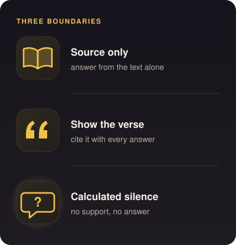
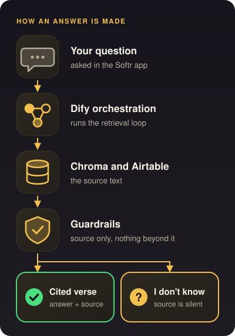
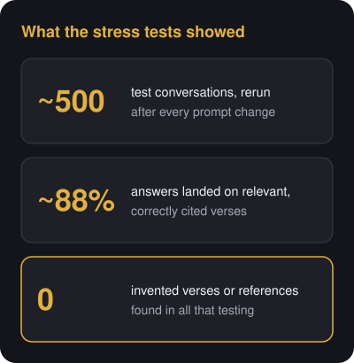
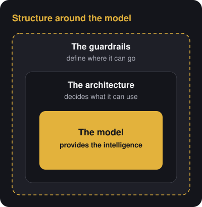

# Kṛṣṇa Uvāca: Decoding Cosmic Counsel
Subtitle: Ancient Wisdom for Modern Life: Architecture of Factual Grounding
Tags: Projects, AI
Date: 2026-09-30
Summary: Ancient Wisdom for Modern Life: Architecture of Factual Grounding

The idea came from a simple moment at home. A conversation needed the exact reference to a particular piece of wisdom in the Bhagavad Gita, and finding the precise wording meant digging back through the text by hand.

That moment pointed to a broader challenge. Enterprise systems are good at managing structured data, but answering accurately from unstructured text is a different problem. **Kṛṣṇa Uvāca** was built as a live sandbox to explore it, a conversational AI where the source, not the model's confidence, decides what can be said.

## Retrieval Isn't Enough

Retrieval-Augmented Generation (RAG) makes the basic workflow look simple. Pull relevant passages from a trusted source and give them to the language model as context. But retrieval alone isn't enough, because a model can find the right text and still invent details beyond it.

So the design rests on three strict boundaries.

- **Source only.** Answer using only the retrieved source text.
- **Show the verse.** Cite the exact verse behind every answer.
- **Calculated silence.** Don't answer when the source doesn't support one.

That last boundary was the most interesting engineering challenge. Generative AI is built to produce text, and this system had to know precisely when not to.

## Composable Stack

Instead of building a heavy custom platform, the sandbox connects specialized tools like building blocks.

- **Dify and Make.com** run the orchestration, the conversation flow, multi-turn memory and the calls between services.
- **Chroma and Airtable** hold the source text the answers are drawn from.
- **Softr** presents a clean web app that works across devices.

## Testing for Failure

The priority was verification, not growth. A system like this can't only be tested with questions it should answer. It has to be pushed with questions it shouldn't.

An evaluation harness ran roughly 500 test conversations, rerun every time the prompts changed, including cases where the answer was entirely absent from the text. About 88% of answers landed on relevant, correctly cited verses. More telling, whenever the answer wasn't in the text, the system said so instead of guessing, and across all that testing I didn't find a single invented verse or reference.

> Sometimes the right AI response isn't a better answer. It's an honest "I don't know."

## Takeaway

- **The model** provides the intelligence.
- **The architecture** decides what information it can use.
- **The guardrails** define where it can go.

As AI moves into specialized enterprise work, the goal can't be systems that always force an answer. It's systems that know when they have enough evidence to give one.

**[Explore the live sandbox at krsna.sandeepmidde.com](https://krsna.sandeepmidde.com/)**

