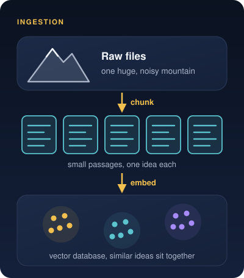
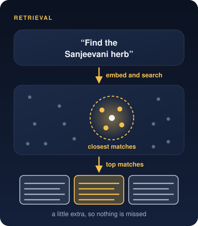
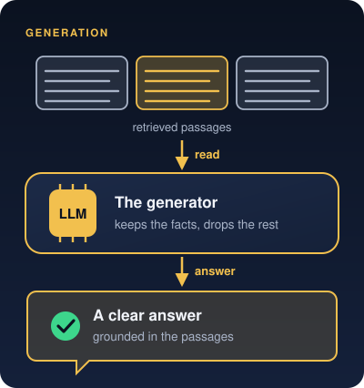
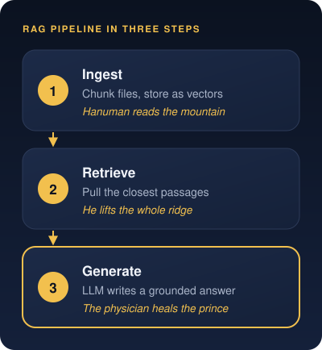

# The Mountain Quest: Decoding RAG Components
Subtitle: Viewing data indexing, vector retrieval, and LLM generation through the lens of a legendary rescue mission.
Tags: AI, RAG, Stories
Date: 2026-10-02
Summary: Viewing data indexing, vector retrieval, and LLM generation through the lens of a legendary rescue mission.

## Race Against Dawn

In the [Archer's Target](posts/the-arjuna-algorithm/) we saw why RAG, or Retrieval-Augmented Generation, stops AI from guessing. In the [Ultimate Cosmic Race](posts/ultimate-cosmic-race/) we saw how a vector database maps meaning. This story puts every piece of the pipeline together.

It comes from the **Ramayana**. During a great battle, the prince **Lakshmana** lies unconscious on the battlefield. The royal physician, **Sushena**, gives a clear ultimatum. A rare medicinal herb called **Sanjeevani** grows on a distant mountain. Bring it before dawn, or the prince will not survive.

There is no time for trial and error and no room for mistakes.

This rescue mission maps closely onto the path a RAG pipeline follows. Every step of the quest lines up with a core engineering component that lets modern AI stop guessing and start answering from verified facts.

## Ingestion and Vector Storage

The warrior **Hanuman** flies to **Mount Dronagiri** and finds a sprawling wilderness covered in thousands of plants, trees and roots. The medicine is there, but it is surrounded by background noise.

Before an AI can answer a question, it faces the same challenge while building its knowledge base.

- **Chunking.** Hanuman can't take in the whole mountain as one massive object. He has to read the terrain plot by plot and patch by patch. In the same way, the system slices large documents and files into small, manageable passages called **chunks**.
- **Vector database.** Every plant on the mountain has its own properties, altitude and location. In AI, each chunk is converted into a list of numbers called a **vector embedding** and stored in a **vector database**. A chaotic collection of words becomes an organized map where ideas with similar meanings sit right next to each other.

## Semantic Retrieval

Standing on the mountain, Hanuman holds on to the physician's instruction. Find the Sanjeevani herb. That instruction is the **user query**.

He doesn't scan the mountain for any green plant. He looks for the specific properties of the medicine, matching the intent and meaning of the request rather than the surface.

When the herb proves hard to isolate in time, Hanuman makes a strategic call so he won't return empty-handed. He lifts the entire ridge that holds the medicinal plants, which guarantees the right herb is inside his payload before dawn.

In an AI system, this job belongs to the **retriever**. It turns the user's question into a vector embedding, searches the vector database for the nearest matches and pulls the top few passages out of the background noise. Like the ridge, that payload deliberately holds a little more than the exact answer, so nothing important is left behind.

## LLM Generation

Hanuman returns and sets the ridge down in front of the medical tent. A raw mass of rock, mud and unrefined plants can't heal the prince on its own. The material is still too raw to use.

This is where the physician steps in. He represents the **Large Language Model**, or LLM, also called the **generator**.

The physician no longer needs to guess at a cure, because the source material is right in front of him. He picks out the exact leaves, prepares the medicine and gives it to the prince, who recovers.

This is the final phase of the pipeline. The LLM reads the passages the retriever handed over, sets aside what is irrelevant, pulls out the facts that answer the question and uses its language skills to write a clear, natural answer grounded in that evidence.

## RAG Blueprint

When you ask a data-backed AI tool a question, this whole journey usually runs in a second or two.

1. **Ingestion.** Raw files are sliced into chunks and mapped as vectors in a vector database.
2. **Retrieval.** The retriever searches that map and pulls the passages closest in meaning to the question.
3. **Generation.** The LLM reads those passages and writes a clear answer grounded in them.

Building a reliable AI isn't about giving a model a bigger brain. It's about building the engine that knows how to bring the mountain to the physician.

> Map the mountain, lift what matters, and let the physician do the healing.
