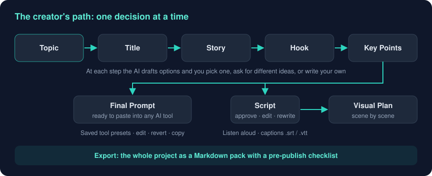
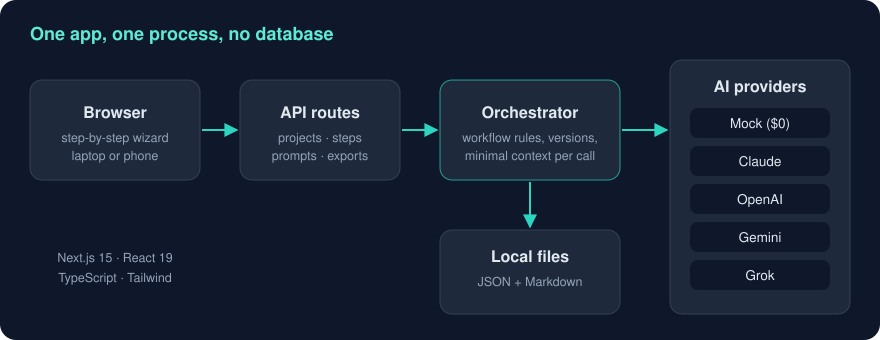

# Observer Prime | AI Drafts, You Decide
Tags: Projects, AI, Content Creation
Date: 2026-09-23
Summary: A local-first AI workbench that turns one topic into a complete YouTube video plan, with the creator approving every step.

Observer Prime is a local-first web app that helps a YouTube creator turn a single topic into a complete video plan covering the title, story, hook, key points, full script, visual plan and draft captions. The AI drafts everything, and the creator decides everything. Here's what we built, how we built it, and why we threw away the first version.

## The problem we set out to solve

Making a thoughtful video involves a lot of mechanical thinking before any creative work happens, like researching the topic, finding an angle, structuring the story, writing a hook, drafting the script, planning visuals, and writing titles and descriptions. AI can speed up every one of those steps. But most tools either generate a finished, generic video with no human judgment in it, or leave the creator juggling a dozen chat windows.

We wanted the middle ground. **Automate the research, drafting and mechanical work, and keep editorial judgment firmly with the human.**

## The guiding rules

We wrote these down before building, and every feature is checked against them.

- **The creator is the editor.** AI proposes and people decide.
- **Plain language, one decision at a time.** No jargon, no dashboards full of knobs.
- **Each AI call gets only the context it needs.** This keeps output focused and token costs down.
- **Works with any AI provider, and costs $0 by default.**
- **Data stays local and private.**
- **Don't overengineer.**
- **Genuine originality.** The output has to meet YouTube's originality expectations, not just repackage existing content.

## How a creator uses it

1. **Start with a topic.** Type something like *"Why do smart people struggle to explain what they know?"* and press Start. Title ideas appear straight away.
2. **Walk the steps.** At Title, Story, Hook and Key Points, the AI offers options. The creator can pick one (*Use this*), ask for different ideas with feedback, or write their own. Choosing moves the flow to the next step.
3. **Change your mind safely.** Reopen any earlier step and everything after it is cleared, because it was built on the old choice. The project never ends up with a hook that contradicts its story.
4. **Get a Final Prompt** tailored to whichever AI video or image tool you use. Save tools as presets, and edit, revert or copy prompts.
5. **Write the script** (optional). Approve it, edit it, or rewrite it with feedback, and switch between versions. **Listen** reads it aloud in the browser. **Captions** downloads draft `.srt` / `.vtt` files.
6. **Build the Visual Plan** scene by scene from the approved script.
7. **Export** the whole project as a Markdown pack with a pre-publish checklist.

Two global controls make it feel like a real tool rather than a demo. **Channel rules** capture your channel's promise, audience and style once, and apply them to every project. A **prompt editor** shows the exact instructions sent to the AI for each project, so nothing is a black box.

## Under the hood

Observer Prime is deliberately a **single Next.js 15 application**, using React 19, TypeScript and Tailwind. The interface and the API run in one process. It listens on the local network, so a phone on the same Wi-Fi can use it too.

- **The orchestrator** is the heart of the system. All workflow rules live in one module, which decides which steps are unlocked, how versions are tracked, what gets cleared when an earlier choice changes, and exactly what context each AI call receives.
- **The provider layer** puts Claude, OpenAI, Gemini, Grok and a free **mock provider** behind one interface. The provider and model can be switched while the app is running, and token usage is shown in the top bar.
- **Prompt templates** cover all seven AI calls, with placeholders like `{{topic}}`, `{{story}}` and `{{channel_rules}}`. Each call has an output budget.
- **Storage** is plain JSON and Markdown files. Writes are queued and atomic, so two actions never corrupt a project, and older project files are upgraded automatically when they're opened.

There's no database, no login and no background jobs. For a single-creator tool that runs locally, none of those would earn their keep.

## The most important decision was throwing away V1

This is the part I most want the whole team to hear.

| Version | What it was |
|---|---|
| **V1** | A *parallel* workbench. Five AI workers analysed the topic at the same time (research, angles, psychology, story, skeptic), then a synthesis step, then five more workers produced a production pack. |
| **V1.1** | Replaced by a *sequential* wizard running Topic → Title → Story → Hook → Key Points → Final Prompt. |
| **V1.2** | Per-project prompt editor, provider and model switching while running, token usage display. |
| **V2** | Stabilisation, creator tools (channel rules, tool presets, prompt editing, delete, export), production documents (script, visual plan, captions, read-aloud) and automated tests. |

V1 worked. Technically it was the more impressive design, with parallel workers, staged waves and synthesis. But when the creator actually used it, the verdict was clear. **It was too technical.** Ten boards of AI output at once is a review burden, not a creative tool.

So we made the call to replace it with something simpler, one decision at a time. Here's how I'd frame the lesson for each audience.

- **For senior leaders.** An architecture that impresses in a demo isn't necessarily one that works for the user. We had working software and still changed direction, because the goal was a creator who ships videos, not an elegant pipeline.
- **For junior engineers.** Don't get attached to your first design. Watch a real user try it. Their confusion is the most valuable data you'll get.

## Quality

V2 ships with these checks passing.

- **Type checking.** `npm run typecheck` passes
- **Automated tests.** 36 tests on Vitest, run against a temporary data folder using the mock provider, so they cost nothing and need no network
- **Build.** Production build passes
- **End-to-end.** 21 API checks covering the full workflow

The mock provider is an under-appreciated decision here. Every feature can be developed and tested for free, and a real AI provider is only needed when you want real output.

We're also honest about the gaps.

- The new V2 screens are type-checked and their API is tested end to end, but no one has clicked through the full UI in a browser yet.
- The Script and Visual Plan prompts have so far only been run against the mock provider. We still need to measure output quality with real models.
- Caption timing is estimated from word count (about 150 words a minute) until a real voiceover exists.

## What's next

| Phase | Scope | What it depends on |
|---|---|---|
| **V2 (rest)** | Production voiceover, visual asset generation, basic video assembly, secure remote access | Choosing a text-to-speech provider, an image provider and budget, ffmpeg, and a private-network approach such as Tailscale |
| **V3** | YouTube publishing, including upload preparation, description and chapters, thumbnail concepts, AI-disclosure guidance, scheduling | Google Cloud project and YouTube Data API access |
| **V4** | Analytics feedback loop that imports click-through rate, retention and views, links them to each video's title, hook and structure, and feeds "what worked for this channel" back into the default prompts | V3 being in place |

V4 is where this goes from a drafting tool to a learning system. The channel's own performance data shapes the next video's first draft.

## The takeaway for the team

Observer Prime is a good template for how we should build **human-in-the-loop AI** anywhere in the business.

1. Break the work into decisions a person can actually make.
2. Give the AI just enough context for each decision.
3. Keep the human's approval as the gate between stages.

The AI does the heavy lifting, and accountability stays with people. And when the elegant version doesn't serve the user, have the discipline to replace it.
