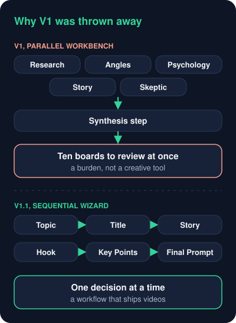
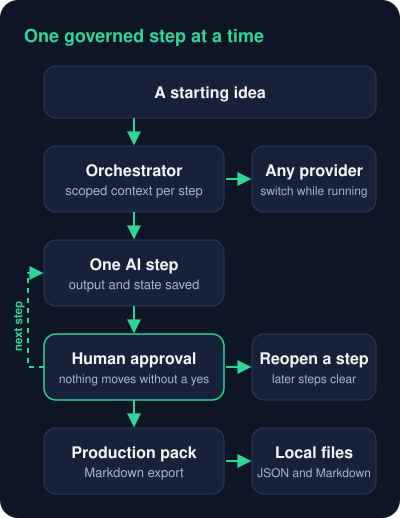
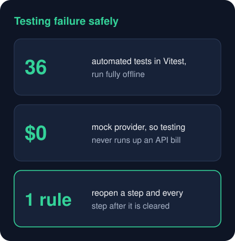

# Observer Prime, Governing Agentic Workflows
Tags: Projects, AI
Date: 2026-09-23
Summary: Building a multi-agent workflow engine proved that real autonomy needs firm human-in-the-loop guardrails to keep the system from drifting.

## System Drift

In the world of automation, we are hearing a lot about **multi-agent systems**. The idea is simple. Instead of using one AI chatbot, you deploy a team of specialized digital assistants to handle a long, multi-step project for you, such as doing deep research, auditing a legal contract or building a structured operating plan.

It sounds incredible in theory. But when you run these automated AI teams over a long stretch of work, you hit a major real-world bottleneck, **system drift**.

Think of it like a game of telephone. The further an AI team progresses through a project without a human checking its work, the more it loses focus. A small mistake at step two compounds into a completely flawed final product by step ten.

I built a local framework called **Observer Prime** to tackle exactly this problem. The goal was simple. Let AI do the exhausting heavy lifting without losing control of the final outcome.

## Tearing Down the Complex Version

When I first started this project, I fell into a classic engineering trap. I built a beautifully complex parallel workbench.

When you gave the system a topic, five AI agents went to work at the same moment. One handled raw research, another explored angles, a third studied audience psychology, a fourth shaped the story and a fifth played the skeptic. A synthesis step then pulled all of it together.

On paper, it was a highly impressive design. But once it was put to real use, the verdict was immediate. It overwhelmed the operator. Reviewing ten boards of competing AI opinions at the same time felt like a massive cognitive burden, not a helpful tool.

So I made the call to scrap that version entirely. I tore it down and replaced it with a simple, sequential pipeline that handles one decision at a time.

The leadership lesson here is vital. An architecture that looks brilliant in a technical presentation is useless if it paralyzes the person using it. Real discipline means having the courage to abandon an elegant, over-engineered pipeline when a simpler approach works better.

## Designing the Guardrails

To make the system dependable, the focus shifted from adding features to enforcing three simple operating boundaries.

- **One step at a time.** The workflow is broken into clear milestones. The AI proposes options for one specific step, and the human decides before anything moves forward.
- **Context budgets.** Instead of drowning the AI in a sea of data, each step is fed only the exact, minimal information its task needs. This keeps the output focused and keeps computing costs down.
- **The approval gateway.** The AI does the grunt work, but a human operator is the mandatory gatekeeper. If you change your mind about a decision made at step one, the system automatically clears everything after it, so later work can never contradict the foundational plan.

## Testing for Failure

A truly reliable system can't only be tested with tasks it knows how to handle. It has to be deliberately pushed into the situations where things go wrong.

To do that safely without running up technology bills, I built a simulated AI provider into the testing setup. It made it possible to run 36 automated checks completely offline, at no cost.

The objective wasn't just to see whether the AI could generate answers. The real goal was to prove the workflow itself holds up. Every step unlocks in the right order, changing an early decision cleanly clears everything after it, and a project's files are never left half-written, because every save is queued and completed in one piece.

## Takeaway

Building this framework proved a vital principle for how we should implement automation anywhere in a business.

- **The AI** handles the repetitive, high-volume drafting.
- **The architecture** defines the strict boundaries of what data can be used.
- **The human** keeps ultimate strategic accountability.

As technology moves deeper into specialized corporate functions, the goal can't be to hand complete, unchecked execution over to software. The real win lies in building intelligent systems that do the exhausting mechanical legwork, while keeping the human operator firmly in control of the final call.

