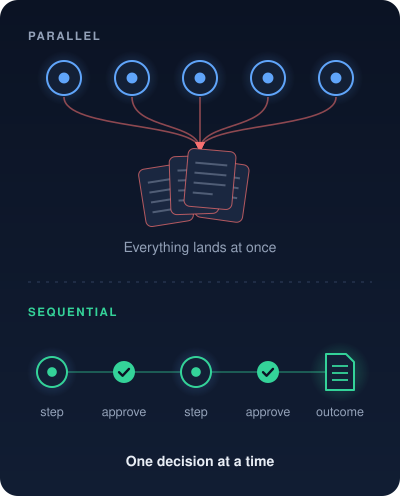
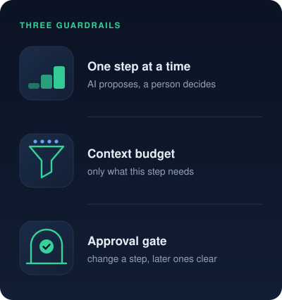
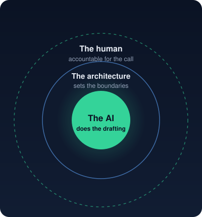

# Observer Prime, Governing Agentic Workflows
Tags: Projects, AI
Date: 2026-09-23
Summary: Building a multi-agent workflow engine proved that real autonomy needs firm human-in-the-loop guardrails to keep the system from drifting.

Multi-agent systems promise a lot. Instead of one AI chatbot, a team of specialized AI assistants takes on a long, multi-step project, such as deep research, auditing a contract or building a structured operating plan.

Run those agents over a long stretch of work, though, and they hit a real bottleneck, **system drift**. The further they go without a human checking the work, the more they lose focus. A small mistake at step two compounds into a flawed final product by step ten.

I built **Observer Prime**, a local workflow framework, to solve exactly this. Let AI do the heavy lifting without losing control of the outcome.

## Sequential by Design

Running several agents in parallel and reviewing all their output at once creates a heavy review burden, and it hides where an error first crept in. So Observer Prime runs as a sequential pipeline. Each step produces one output, a person approves it, and only then does the next step begin.

## Designing the Guardrails

Three simple boundaries make the system dependable.

- **One step at a time.** The AI proposes options for one step, and the human decides before anything moves forward.
- **Context budgets.** Each step gets only the minimal information its task needs, which keeps output focused and costs down.
- **The approval gateway.** A human is the mandatory gatekeeper. Change a decision at step one, and everything after it is cleared, so later work never contradicts the plan.

## Testing for Failure

A simulated AI provider built into the testing setup runs 36 automated checks completely offline, at no cost. They prove the workflow holds up. Steps unlock in the right order, changing an early decision clears everything after it, and every save completes in one piece, so a project's files are never left half-written.

## Takeaway

- **The AI** handles the repetitive, high-volume drafting.
- **The architecture** sets strict boundaries on what data can be used.
- **The human** keeps strategic accountability.

The goal isn't to hand unchecked execution over to software. It's to build systems that do the mechanical legwork while the person stays in control of the final call.

