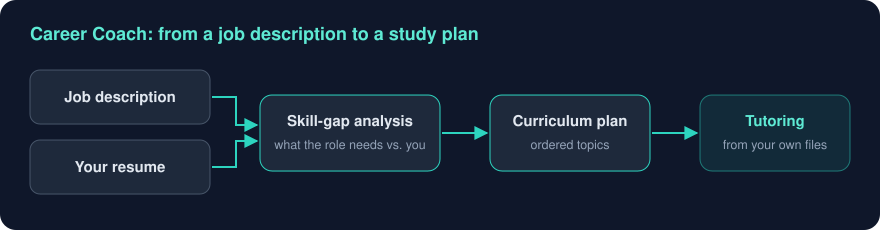
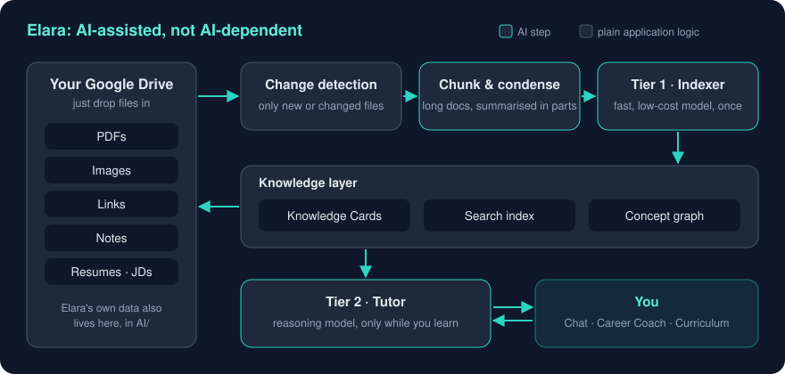

# Project Elara: A Personal Tutor That Learns From Everything You Save
Tags: Projects, AI, Learning
Date: 2026-09-23

Elara is an AI-powered personal learning workspace, best described as NotebookLM combined with a personal tutor. You drop PDFs, screenshots, links, notes, resumes and job descriptions into your own Google Drive. Elara reads them, organises them, and teaches you from them. You never file, tag or categorise anything.

## The problem

We all collect far more than we ever learn from: PDFs we meant to read, bookmarked articles, LinkedIn posts, screenshots of diagrams, a job description we're preparing for. The usual answer is to *organise* all of it into folders, tags and notebooks. That's work, and most of us never do it, so the material just sits there.

Elara flips the model. The user has only two jobs:

1. **Save knowledge.**
2. **Learn.**

Everything in between, including reading, summarising, classifying, linking related ideas, and planning what to study next, is Elara's job.

## What Elara does

| Capability | What the user experiences |
|---|---|
| **Sign in with Google** | Your Google Drive becomes Elara's storage. It creates its own folder structure the first time you sign in. |
| **Automatic understanding** | Every file becomes a **Knowledge Card** with a summary, key concepts, topics, difficulty, prerequisites, examples and suggested follow-up topics. No manual tagging. |
| **Chat grounded in your material** | Ask anything. When your saved material is relevant, Elara uses it and says which sources it drew on. Otherwise it answers from general knowledge and makes clear which is which. |
| **Learning styles** | Free-form chat by default, or switch to a structured style such as a quiz or a mock interview, with adjustable difficulty. |
| **Career Coach** | Attach a job description and your resume. Elara analyses the skill gap and generates a curriculum plan, all inside the conversation. |
| **Knowledge that builds on itself** | A useful answer can be saved as a new **Knowledge Note**, which becomes part of what Elara learns from. |
| **Diagrams in chat** | Explanations can include rendered diagrams, not just text. |
| **Bring your own AI key** | Use OpenAI, Anthropic Claude, Gemini, OpenRouter or Groq. The key is encrypted before it's stored, and Elara never pays for, or marks up, AI usage. |

## How it's built

The stack is intentionally small: **Next.js 16, TypeScript and Tailwind**, with Google sign-in, the Google Drive API for storage, and plain HTTP calls to the AI providers, with no provider-specific SDKs. It's designed to deploy on Vercel.

What's more interesting is what we *didn't* use. The original specification explicitly ruled out a traditional database, a vector database, LangChain and agent frameworks. **All persistent state lives in the user's own Google Drive**: Knowledge Cards as Markdown files, conversations as JSON, and the search index and concept graph as small cache files.

### The core idea: AI-assisted, not AI-dependent

Midway through the build we reworked the architecture around one principle. Use AI only where you genuinely need human-like understanding, and use ordinary code for everything else. That gives us two tiers:

- **Tier 1, the indexer.** A fast, low-cost model, with Groq as the suggested default thanks to its generous free tier, reads each document *once* and produces its Knowledge Card. Change detection means unchanged files are never processed twice. Long documents are split into chunks, each chunk is summarised, and the summaries are merged, so a long PDF is condensed rather than cut off.
- **Tier 2, the tutor.** A stronger reasoning model is used only while you're actively learning in a conversation.
- **Everything in between is plain code.** That includes change detection, search, conversation history and the **concept graph**. The concept graph lets Elara find relevant material through shared ideas, not just shared keywords. Ask about "event sourcing" and it can surface a saved article about "CQRS" even if the words never match.

For the CTO conversation, the benefits are cost and predictability. The expensive model is only called when a person is actively learning. Indexing cost is paid once per file. And because retrieval is ordinary code, it's testable and explainable in a way a black-box pipeline isn't.

For the junior engineers: before reaching for an AI call, ask *"could a normal function do this?"* Often it can, and it'll be faster, cheaper and easier to debug.

### Keeping costs flat as conversations grow

Every chat message is saved to Drive in full, but only the most recent 20 messages are sent to the model. A long-running conversation doesn't get steadily more expensive with each reply. Conversation titles come from the first message rather than an extra AI call. Small decisions like these are what keep a "bring your own key" product affordable for its users.

## A product decision worth sharing: we changed our own rules

The original spec was emphatic that Elara should *"never feel like ChatGPT"*. It asked for separate, structured pages for sessions, career coaching and curriculum, with no endless scrolling conversation.

We built exactly that. Then we used it, and found the structure got in the way. Building on saved knowledge or a generated plan was awkward when every interaction was its own isolated page.

So, deliberately and with the product owner's sign-off, we **unified Sessions, Career Coach and Curriculum into one persistent, auto-saving chat**, and kept the structured modes as optional styles you can switch to at any time. Navigation shrank to four items: Home, Chat, Knowledge Sources and Settings.

The lesson is the same one we learned on Observer Prime, from the opposite direction. **Principles serve the user, not the other way round.** Write them down, follow them, and change them openly when real usage proves them wrong.

## Where we stand

Honest status:

- **Built:** all four planned phases. That covers Google sign-in, Drive storage and settings; background indexing, Knowledge Cards and search; and job description and resume analysis, skill-gap analysis and curriculum plans. Both redesigns, the unified chat and the two-tier architecture with the concept graph, are built too. Lint and production build are clean.
- **Confirmed with a real Google account and a real AI key:** sign-in, indexing, loading Knowledge Cards, a real chat reply, and listing conversations. Testing also turned up and fixed a search bug where very short words matched too loosely.
- **Still to confirm end to end:** concept-graph retrieval in a live conversation, indexing a very long PDF, the separate indexing-provider setting, and a full Career Coach thread. That walkthrough was paused by a local development-environment issue, not an application bug.
- **Not yet in scope:** video and audio files. The folders exist, but transcription is deferred.

## What's next

1. Finish the live end-to-end walkthrough and fix whatever it finds
2. Deploy to Vercel, the planned hosting target
3. Video and audio transcription, which would also enable a voice tutor
4. Scale work: larger libraries (thousands of documents), sharded indexes and fuzzier concept matching. We deliberately haven't done this yet, because we'll build for scale once real document volumes justify it.

## The takeaway for the team

Elara is a small product carrying three ideas we should apply anywhere we use AI:

- **Let users own their data.** Their files, their Drive, their key.
- **Tier your AI.** Use cheap models for one-time understanding and strong models only for high-value interaction.
- **Code first, AI where it counts.** Every AI call you *don't* make is cheaper, faster and easier to debug.

The result is a tutor that gets smarter with everything you save, and doesn't cost more to run the longer you use it.
