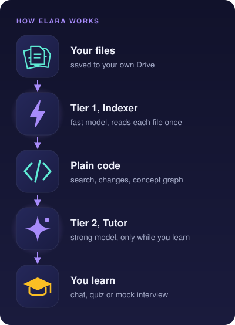
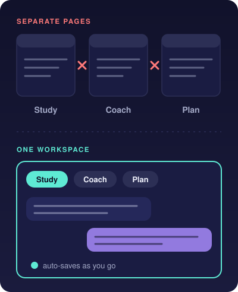
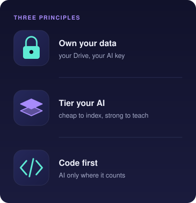

# Project Elara, Architecture of Knowledge Ingestion
Tags: Projects, AI, Learning
Date: 2026-09-23
Summary: Save knowledge, then learn. Elara handles everything in between, reading, summarizing and connecting what you save.

We all fall into the digital accumulation trap. We save interesting articles, download PDFs and screenshot complex diagrams, promising to read them later. Sorting all of it into folders and tags feels like a chore, so we never do it, and the material sits there, buried and forgotten.

I built **Project Elara**, a personal learning workspace, to reverse that. The user has only two jobs, **save knowledge** and **learn**. Everything in between, reading, summarizing and mapping how ideas connect, is handled by the system. You drop messy files into your own Google Drive, and Elara automatically turns them into a searchable, self-indexing knowledge base you can learn from.

## Two-Tier Architecture

The usual playbook calls for a complex, expensive AI stack. Elara starts from strict constraints instead. No database, no vector store, no agent frameworks, and complete data privacy, with everything stored in the user's own Drive.

It also avoids a common habit, using AI for work that ordinary code does better. The system splits into two tiers.

- **Tier 1, the indexer.** A fast, low-cost model reads each document once to extract key concepts and write a summary. Unchanged files are never processed again, which keeps indexing cost low.
- **Tier 2, the tutor.** A stronger reasoning model is used only while you are actively learning, in a live chat, a quiz or a mock interview.

Everything else, detecting file changes, search, conversation history and the concept graph that links related ideas, is plain, predictable code. The result is cheap to run, transparent and easy to debug, because finding your data never depends on a black box.

## One Continuous Workspace

Separate pages for study sessions, career coaching and curriculum planning made it awkward to connect a newly saved article with an active study plan. So Elara brings everything into one continuous, auto-saving workspace, with quizzes, mock interviews and the career coach available as styles you can switch to at any moment.

## Takeaway

Project Elara is a practical template for automation and data processing anywhere in a business.

- **Data ownership.** Users keep control of their files, their privacy and their own AI key.
- **Tiered intelligence.** Fast, inexpensive models handle routine processing, and powerful models are saved for high-value interaction.
- **Code first.** Never use an unpredictable AI call when a normal function can do the job faster, cheaper and more reliably.

The result is a system that gets smarter with everything you save, on an architecture that stays stable and cost-effective over time.

