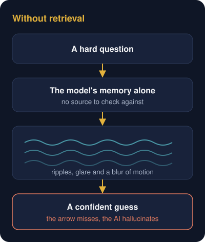
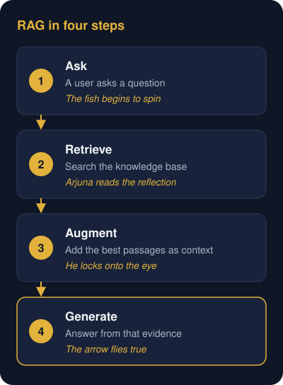
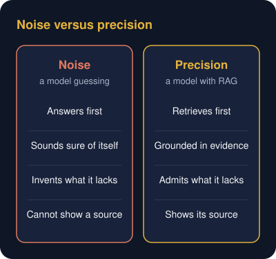
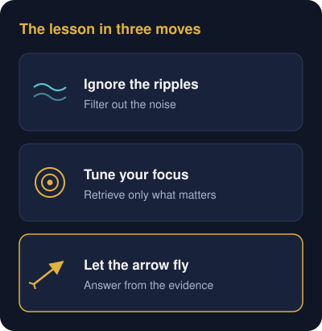

# The Archer's Target: Decoding RAG
Subtitle: Understanding AI accuracy, retrieval pipelines, and focus through the lens of a legendary archery test.
Tags: AI, Explainers
Date: 2026-10-01
Summary: History's greatest archer mastered data retrieval using nothing but a bow and a pool of water.

## Why RAG Matters

In the fast-moving world of Artificial Intelligence, the tech sector is anchored around a single three-letter acronym. **RAG**, or Retrieval-Augmented Generation.

At its core, RAG is the architecture that stops AI from guessing. It lets an AI model search through a massive ocean of data, filter out background noise and isolate the exact fact required to answer a question accurately.

While it sounds like cutting-edge 21st-century science, the underlying logic is thousands of years old. History's greatest archer mastered data retrieval using nothing but a bow and a pool of water. Tucked inside the ancient Indian epic, the **Mahabharata**, is the story of a legendary warrior prince named **Arjuna**. His most famous test explains exactly how modern engineering closes the AI reliability gap today.

## Hallucination Pool

The story opens at a grand royal tournament where the finest archers gather to compete. The challenge set before them appears impossible. Pierce the eye of a rotating wooden fish suspended high up on a towering pole.

The catch? The archer may not look up at the target. They can only look down into a pool of water and aim by tracking the fish's moving reflection on the surface.

Dozens of warriors step up. When they look down, blinding sunlight and wind-driven ripples distort the reflection. Seeing only a moving blur, they panic, shoot blindly into the sky and miss the target completely.

This is exactly what happens when a standard large language model tries to answer a complex query without context. It scans a messy sea of information, gets confused by the noise and **hallucinates**, shooting a confident guess into the dark.

## Precision Shot

Then Arjuna steps forward.

Arjuna had one rare capability, absolute and unbroken focus. He stood over the pool, completely still. Where others saw blinding glare and chaotic waves, his mind worked like a precision search engine. He tuned out the crowd, waited for the ripples to settle and looked directly through the surface noise. He mapped the trajectory, judged the speed of the moving target and isolated its true position.

With complete calm, he released the string. The arrow soared upward and struck the eye of the fish cleanly.

This is the operating flow of Retrieval-Augmented Generation.

- **The distorted pool** is the massive store of messy, unstructured data.
- **The moving fish** is the complex, changing question a user asks the AI.
- **Arjuna** is the RAG pipeline. Instead of guessing, he retrieved the exact fact from the reflection and let it guide his arrow straight to the target.

## Tuning Out the Noise

There is a second, deliberate layer to this story. In Indian classical music, a **Raga**, often shortened to Rag, is a melody built by playing notes in a highly disciplined sequence until they reach perfect harmony.

Arjuna was a master of music, but his greatest composition came from the immense tension of his legendary bow, **Gandiva**. The ancient texts note that whenever he drew the string to face a crisis, it gave out a deep, resonant, booming twang. To everyone on the battlefield, it didn't sound like chaotic noise. It sounded like a single, flawless, terrifying note. A lethal Rag played on a single string.

While other warriors fought with wild, unpredictable swings, Arjuna fought with mathematical precision. Every pull of the string was tuned to its destination. His archery wasn't chaotic warfare. It was a disciplined performance where every single shot mattered.

## Archer's Blueprint

Today, software teams are building digital Arjunas. With RAG, they are training models to stop generating noise and start operating like legendary archers. They are building systems that look into a vast pool of information, filter out the ripples of distraction and answer only from the evidence they find.

Whether you are designing an enterprise AI pipeline, running operations or mastering a new delivery discipline, the pattern stays the same.

> Don't get distracted by the ripples in the water. Tune your parameters, ground your focus and let your arrow fly straight to the center of the target.

