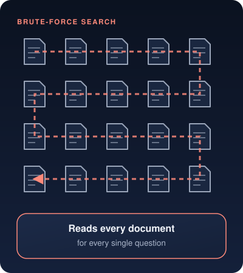
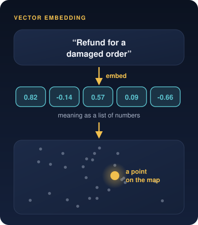
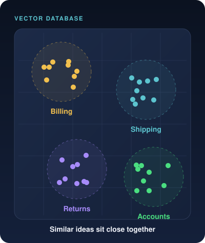
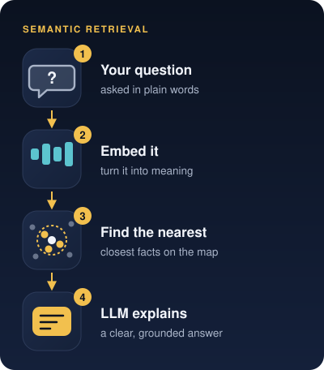
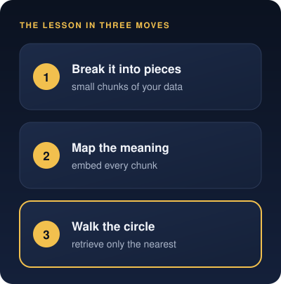

# Ultimate Cosmic Race: Decoding Vector Databases
Subtitle: Viewing data fragmentation, semantic search, and AI indexing through the lens of a legendary journey.
Tags: AI, RAG, Stories
Date: 2026-10-02
Summary: Viewing data fragmentation, semantic search, and AI indexing through the lens of a legendary journey.

## From Target to Map

In our [last story](posts/the-arjuna-algorithm/), we saw how RAG, or Retrieval-Augmented Generation, stops AI from guessing by giving it a precise target to aim at.

But how do engineers take a chaotic mountain of data, such as thousands of customer emails, medical texts or user manuals, and organize it so an AI can find a specific answer in milliseconds?

To understand this step without getting lost in math, we can turn to a beloved story about the elephant-headed deity **Ganesha** and his brother, **Kartikeya**.

## Brute-Force Race

The story begins with a divine challenge. Their parents, **Shiva** and **Parvati**, set the brothers a task. Whoever circles the entire universe three times and returns first wins a sacred fruit of wisdom.

Kartikeya leaps onto his mount, a swift and powerful peacock, and races into the sky. He flies at lightning speed, determined to visit every star, every planet and every corner of the cosmos.

In the tech world, Kartikeya is a **brute-force search**. Imagine trying to find one sentence in a library by reading every book line by line, from start to finish. It costs a massive amount of time, energy and computing power, and it has to be repeated for every new question.

## Finding the Core Meaning

Ganesha has a different problem. His mount is a tiny mouse, and he can't outrun a cosmic peacock. So he sits down and thinks deeply. What is the true essence of the universe?

To him, his parents are the source and meaning of the entire cosmos. He asks them to sit together.

In modern AI, this mental leap is called creating a **vector embedding**. Instead of looking at the surface of the words, the spelling and the exact phrasing, the system translates a piece of text into a compact list of numbers that captures its core meaning.

## Mapping the Universe

With his parents seated, Ganesha walks around them three times in a quiet circle. In doing so, he creates a perfect miniature of the entire universe right in front of him.

That miniature, organized map is what engineers call a **vector database**.

Instead of searching a sprawling digital universe every time someone asks a question, engineers break the business data into small pieces, turn each piece into an embedding and place it on a mathematical map. Similar ideas land close together, so a vast universe of data becomes a dense, well-organized map.

## Winning the Race

While Kartikeya is still exhausted, flying past distant galaxies, Ganesha completes his three circles, bows to his parents and wins the race. He didn't need to visit every star. He only needed his well-organized map.

When you ask a modern AI system a question, it runs **semantic retrieval** in the same way.

1. It skips scanning every document.
2. It turns your question into its core meaning, a vector embedding.
3. It finds the closest matches on its organized map, the vector database.
4. It hands those facts to the Large Language Model, which acts like a master storyteller and explains the answer clearly.

## Takeaway

Building a powerful AI engine isn't about running faster or having a bigger brain. It's about taking the chaotic universe of human language, mapping its true meaning into a quiet circle and retrieving exactly what matters in milliseconds.

> Don't race around the universe. Map what matters, then walk the circle.

